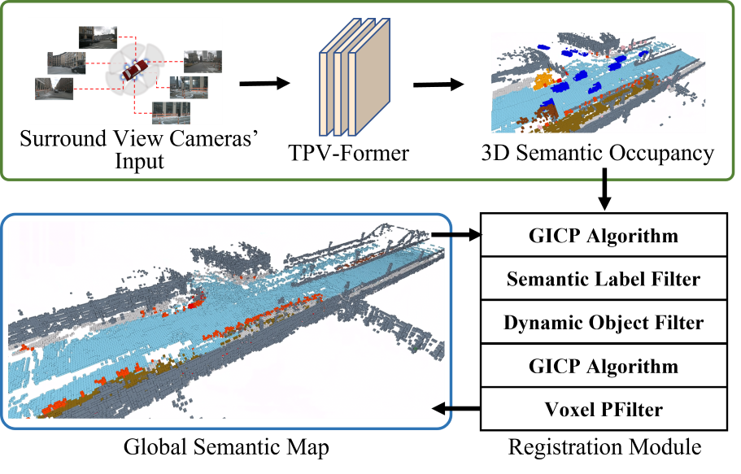

<div align="center">   

# OCC-VO: Dense Mapping via 3D Occupancy-Based Visual Odometry for Autonomous Driving
</div>

# Abstract 

Visual Odometry (VO) plays a pivotal role in autonomous systems, with a principal challenge being the lack of depth information in camera images. This paper introduces OCC-VO, a novel framework that capitalizes on recent advances in deep learning to transform 2D camera images into 3D semantic occupancy, thereby circumventing the traditional need for concurrent estimation of ego poses and landmark locations. Within this framework, we utilize the TPV-Former to convert surround view cameras' images into 3D semantic occupancy. Addressing the challenges presented by this transformation, we have specifically tailored a pose estimation and mapping algorithm that incorporates Semantic Label Filter, Dynamic Object Filter, and finally, utilizes Voxel PFilter for maintaining a consistent global semantic map. Evaluations on the Occ3D-nuScenes not only showcase a 20.6% improvement in Success Ratio and a 29.6% enhancement in trajectory accuracy against ORB-SLAM3, but also emphasize our ability to construct a comprehensive map.

[arXiv](https://arxiv.org/abs/2309.11011) 
[IEEE Xplore](https://ieeexplore.ieee.org/abstract/document/10611516/)

**Here are our [demo.mp4](https://drive.google.com/file/d/19PJcGKtTDNeHtML7I6L5uIMSZDbbJt23/view?usp=drive_link) about OCC-VO.**

# News
- **[2024/05/29]** We have released our code.
- **[2024/02/01]** OCC-VO is accepted to ICRA 2024!

# Pipeline


# Getting Started
**1. Create a conda virtual environment and activate it.**
```shell
conda create -n occvo python=3.8 -y
conda activate occvo
```

**2. You can download our open3d.whl for Python 3.8 from [this link](https://drive.google.com/drive/folders/18PW9KanUN5mwKxRWn3XcFitpvRCXg4Lk?usp=drive_link). This version includes the Semantic Label Filter, a feature we've developed.**
```shell
pip install open3d-0.15.2+f17d4d20-cp38-cp38-manylinux_2_31_x86_64.whl
```

**It is ok if you want to use original open3d.**
```shell
pip install open3d
```

**3. We provide the [occupancy data](https://drive.google.com/drive/folders/18PW9KanUN5mwKxRWn3XcFitpvRCXg4Lk?usp=drive_link) of 150 scenes from the nuscenes validation set used in our experiments.**

# Running
**Here is a usage example. Output trajectory and map data.**
```shell
python run.py \
    --input sample/occupancy/scene-0101 \
    --output_traj output \
    --output_map output
```

**If you have initial transform value, you can use --trans_init like this. It uses the first two poses groundtruth to get initial transform.**
```shell
python run.py \
    --input sample/occupancy/scene-0101 \
    --trans_init sample/trajectory/scene-0101.kitti \
    --output_traj output \
    --output_map output
```


**For more specific parameter details, please refer to the argparse description in [run.py](run.py) .**

# Visualization
**After the program is finished, you can use [visual.py](visual.py) to visualize the trajectory and map.**
```shell
python visual.py  \
    --voxel_size 0.4 \
    --traj ./output/scene-0101.txt \
    --map ./output/scene-0101.npy
```

# Evaluation
**1. Install evo tools.**
```shell
pip install evo
```

**2. Use the evo_ape command for evaluation.**
```shell
evo_ape kitti \
    sample/trajectory/scene-0101.kitti \
    output/scene-0101.txt \
    -a
```

# Citation
If you find this project helpful, please consider citing the following paper:
```
@inproceedings{li2024occ-vo,
  title={Occ-vo: Dense mapping via 3d occupancy-based visual odometry for autonomous driving},
  author={Li, Heng and Duan, Yifan and Zhang, Xinran and Liu, Haiyi and Ji, Jianmin and Zhang, Yanyong},
  booktitle={2024 IEEE International Conference on Robotics and Automation (ICRA)},
  pages={17961--17967},
  year={2024},
  organization={IEEE}
}
```
